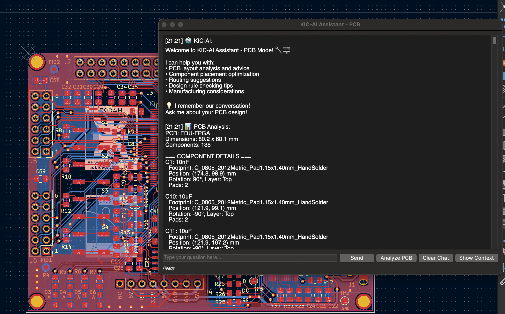
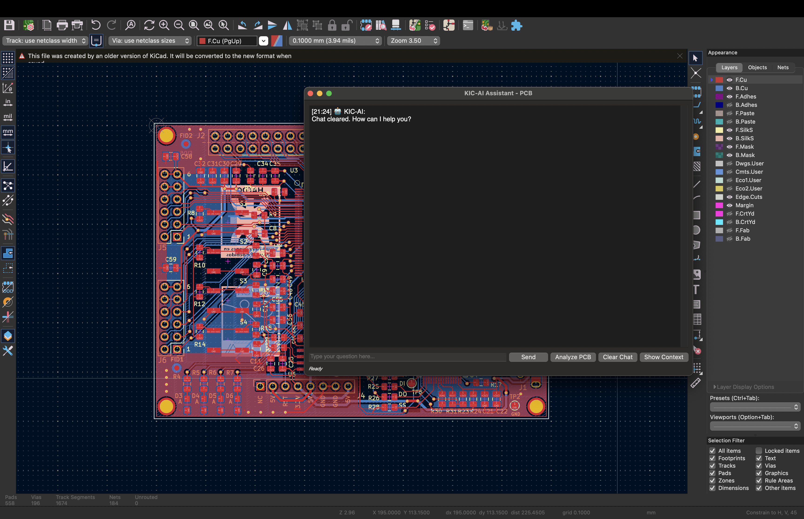
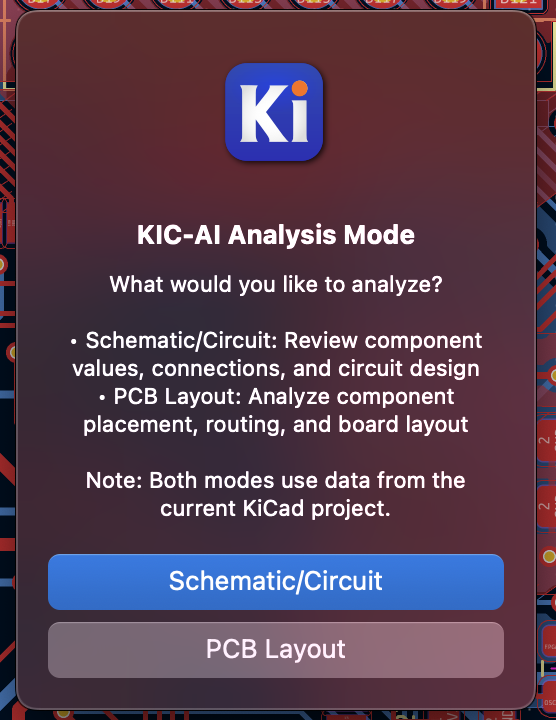
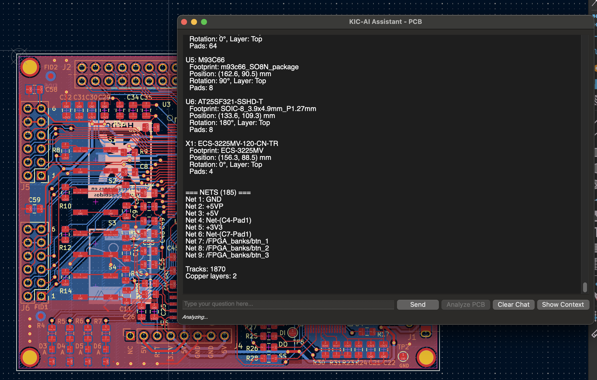

# KIC-AI Assistant

AI-powered PCB design assistant plugin for KiCad with Ollama integration.


## 🤖 Features

- **AI Chat Interface**: Interactive dialog for PCB design assistance
- **Dual Analysis Modes**: Support for both PCB layout and schematic/circuit analysis
- **3 Interaction Levels**: Choose from Analysis, Advisory, or Assistant modes based on your needs
- **Smart Mode Detection**: AI adapts responses based on selected interaction mode
- **Design Advice**: Get practical suggestions for component placement, routing, and best practices
- **Local LLM**: Uses Ollama for privacy-focused AI processing
- **Conversation Memory**: AI remembers context throughout your design session
- **Real-time Help**: Ask questions about your design and get instant, context-aware answers

## 📋 Requirements

- **KiCad 9.0+**
- **Python 3.7+**
- **Ollama** with `llama3.2:3b` model
- **requests** Python package

## 🚀 Installation

### Method 1: KiCad Plugin Manager (Recommended)

1. **Download the plugin ZIP**: [kic-ai-assistant-v1.3.1-for-import.zip](kic-ai-assistant-v1.3.1-for-import.zip)
2. Open KiCad → **Plugin and Content Manager**
3. Click **Install from File**
4. Select the downloaded ZIP file
5. Restart KiCad

> 💡 **Direct Download**: The ready-to-import ZIP file is included in this repository for your convenience!
### Method 2: Manual Installation

1. Download and extract the plugin
2. Copy to your KiCad plugins directory:
   - **Windows**: `%APPDATA%/kicad/9.0/scripting/plugins/`
   - **macOS**: `~/Library/Application Support/kicad/9.0/scripting/plugins/`
   - **Linux**: `~/.config/kicad/9.0/scripting/plugins/`

## 🔧 Setup

### 1. Install Ollama

Download and install Ollama from [ollama.ai](https://ollama.ai)

### 2. Install AI Model

```bash
ollama pull llama3.2:3b
```

### 3. Start Ollama Server

```bash
ollama serve
```

## 💡 Usage

### How to Use KIC-AI Assistant

**Important**: The plugin is accessed through KiCad's **PCB Editor (pcbnew)** but can analyze both schematic and PCB data.

1. **Open your KiCad project in PCB Editor** (File → Open → your_project.kicad_pcb)
2. **Click the KIC-AI robot icon** in the PCB Editor toolbar  
3. **Choose analysis mode**:
   - **Schematic/Circuit**: Analyze component values, connections, and circuit design
   - **PCB Layout**: Analyze component placement, routing, and board layout
4. **Select AI interaction mode**:
   - **🔍 Analysis Mode**: Safe recommendations only
   - **📋 Advisory Mode**: Step-by-step guidance with confirmation
   - **🤖 Assistant Mode**: Interactive assistance and future automation
5. **Start chatting**: Ask questions or click "Analyze" for automatic analysis

### Dual Mode Capabilities

#### 📋 Schematic Mode
- Circuit analysis and component review
- Component value validation  
- Net connectivity analysis
- Circuit design recommendations
- Component selection advice

#### 🔧 PCB Mode  
- PCB layout analysis
- Component placement optimization
- Routing suggestions
- Design rule checking tips
- Manufacturing considerations

### AI Interaction Modes

Choose your preferred level of AI assistance:

#### 🔍 Analysis Mode (Safe)
- **What it does**: Analyzes your design and provides recommendations
- **Safety**: No modifications to your project
- **Best for**: All users, learning, getting design insights
- **Example**: "Your power supply has good decoupling, but consider adding a ferrite bead on the input"

#### 📋 Advisory Mode (Guided) 
- **What it does**: Provides step-by-step instructions with user confirmation
- **Safety**: Guides you through changes with clear steps
- **Best for**: Users who want detailed guidance 
- **Example**: "To improve this circuit: 1) Select R14 2) Change value to 10kΩ 3) Update the schematic. Shall I guide you through this?"

#### 🤖 Assistant Mode (Interactive)
- **What it does**: Detailed step-by-step instructions and component-specific guidance
- **Safety**: Advanced features for experienced users
- **Best for**: Power users, complex design tasks
- **Example**: "Removing J6: 1) Click on J6 2) Press Delete 3) Clean up connections 4) Update schematic 5) Run DRC"

### Example Questions

**Schematic Mode:**
- "Review the power supply circuit"
- "Check if R1 value is appropriate" 
- "Analyze the op-amp configuration"
- "Are there any missing decoupling capacitors?"

**PCB Mode:**
- "How can I improve the routing on this PCB?"
- "Are there any potential EMI issues?"
- "What's the best way to place these components?"
- "Can you review my power distribution?"

**Mode-Specific Examples:**

*Analysis Mode:*
- "What do you think of this design?"
- "Any recommendations for improvement?"

*Advisory Mode:*
- "Help me remove resistor R14"
- "Guide me through optimizing this layout"
- "How do I fix this design rule violation?"

*Assistant Mode:*
- "Optimize my component placement"
- "Help me redesign this power section"
- "What automated improvements can you suggest?"

## 🖼️ Screenshots

### Main Interface
The AI Assistant provides an intuitive chat interface with 3 interaction modes and dual analysis capabilities.



### Mode Selection
Choose from 3 different AI interaction modes based on your experience level and needs.



### Installation in KiCad

*Installing the plugin through KiCad Plugin Manager*

### PCB Analysis
Automatic analysis provides comprehensive design insights and recommendations.



**Analysis Features:**
- Component count and types
- Board dimensions and layer information
- Net and track statistics
- Design recommendations
- Mode-specific AI responses

## 🛠️ Development

### Project Structure

```
KIC-AI-Assistant/
├── metadata.json          # KiCad plugin metadata
├── plugins/
│   ├── __init__.py        # Main plugin entry point
│   ├── ai_dialog.py       # AI chat dialog interface
│   └── robot_icon.png     # Plugin icon
├── screenshots/           # UI screenshots
│   ├── main-interface.png
│   ├── mode-selection.png
│   └── pcb-analysis.png
├── README.md
├── LICENSE
├── CHANGELOG.md
└── UPGRADE_NOTES.md
```

### Building

To create a release ZIP:

```bash
zip -r kic-ai-assistant.zip metadata.json plugins/ -x "*.pyc" "*__pycache__*"
```

## 🤝 Contributing

Contributions are welcome! Please feel free to submit a Pull Request.

1. Fork the project
2. Create your feature branch (`git checkout -b feature/AmazingFeature`)
3. Commit your changes (`git commit -m 'Add some AmazingFeature'`)
4. Push to the branch (`git push origin feature/AmazingFeature`)
5. Open a Pull Request

## 📝 License

This project is licensed under the MIT License - see the [LICENSE](LICENSE) file for details.

## 🙏 Acknowledgments

- **KiCad** team for the excellent PCB design software
- **Ollama** team for local LLM capabilities
- **Meta** for the Llama model

## 📞 Support

If you encounter any issues or have questions:

1. Check the [Issues](../../issues) page
2. Create a new issue with detailed information
3. Include your KiCad version and error messages

## 🔄 Changelog

### v1.3.1
- **ENHANCED**: Assistant Mode now provides detailed step-by-step instructions
- **NEW**: Component-specific guidance for removal operations (e.g., "remove J6")
- **IMPROVED**: More actionable and practical assistance in Assistant Mode
- **FIXED**: Better AI prompts for specific component operations

### v1.3.0
- **NEW**: 3 AI Interaction Modes (Analysis, Advisory, Assistant)
- **NEW**: Mode-specific AI responses and behavior
- **NEW**: Enhanced user interface with mode selection
- **NEW**: Step-by-step guidance in Advisory mode
- **NEW**: Interactive assistance framework for future automation
- **IMPROVED**: Better mode explanations and help system
- **IMPROVED**: Enhanced conversation context awareness

### v1.2.1
- Enhanced dual-mode analysis (PCB + Schematic)
- Improved context-aware AI responses
- Better user guidance and documentation

### v1.0.0
- Initial release
- AI chat interface
- PCB analysis functionality
- Ollama integration
- English interface with larger fonts

---

**Made with ❤️ for the KiCad community**

## 📦 Download Options

**Ready to use:**
- 📦 [kic-ai-assistant-v1.3.1-for-import.zip](kic-ai-assistant-v1.3.1-for-import.zip) (~10KB) - Direct import for KiCad Plugin Manager

**For developers:**
- �� Clone this repository for complete source code, documentation, and screenshots

> 🎯 **For most users**: Download the **for-import.zip** file - it's specifically prepared for KiCad's Plugin Manager!
| File | Size | Description |
|------|------|-------------|
| [kic-ai-assistant-v1.3.1-for-import.zip](kic-ai-assistant-v1.3.1-for-import.zip) | ~10KB | **Ready-to-import plugin** - Use this for KiCad Plugin Manager |

> 🎯 **For most users**: Download the **for-import.zip** file - it's specifically prepared for KiCad's Plugin Manager!

